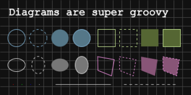

<!--
Diagram - A simple HTML canvas that you can draw stuff on.
Copyright (c) Cliff Earl, Antix Development, 2023.
MIT "plus" License:
-->

# Diagram

 

### What's New with it?

v1.0.0 (8 Oct 2023)

- Initial public release

<!-- 

v?.?.? (dd mmm yyyy)

- detail.
- detail.

 -->

 

### Why is it?

Whilst performing JavaScript experiments, more often than not, I find myself creating an HTML canvas and drawing stuff to it. I do this every time.. from scratch.

Most recently I was experimenting with 2d ray casting and was converting some C++ code to JavaScript and I noticed the programmer ([javidx9](https://github.com/OneLoneCoder)) always uses his own very cool 2d game engine, the olcPixelGameEngine to draw stuff into a window.

The code I was converting had loads of function calls to things like `drawLine()`, and `fillRect()`, which looked easy to use.. way more easy than buggering around with 2d drawing contexts constantly, as is usually the case.

So I decided to create my own little "thing" that would operate in a similar way, thus allowing me to never have to code yet another canvas drawing system!

Why the heck didn't I do this years ago?!

 

### What is it?

Diagram is basically a managed HTML canvas on which you can draw lines, rectangles, circles, text, and grids. In time it may morph into something more, but for now it pretty much ticks all of my own boxes.

If you end up using Diagram, please let me know, I would love to see what you are using it for. Maybe you would also consider [buying me a coffee](https://www.buymeacoffee.com/antixdevelu) :)

 

### What do I do with it?

Really you just include the script, create a diagram, then begin drawing stuff to it. Sounds too easy to be true huh? Well let's look at what functionality diagram provides...

 

### Core methods

Diagram contains the following core methods...

 

`diagram(x, y, width, height)`

Creates a new diagram with the given dimensions, absolutely positioned at the given coordinates.

The diagram will be prepended to the document body and will have a high `zIndex` value meaning that it "should" appear on top of all other HTML elements.

The diagrams default font will be set to "Courier New" with a size of 14 pixels.

 

`clear(color = '111')`

Clear the entire diagram using the given color.

 

`drawLine(x1, y1, x2, y2, color = 'ccc', lineWidth = 1, pattern = [])`

Draw a line between the two given coordinate pairs, using the given color, line width, and pattern.

 

`drawRect(x, y, width, height, strokeColor = 'ce9', lineWidth = 1, pattern = [])`

Draw an outlined rectangle using the given coordinates, dimensions, color, line width, and pattern.

 

`fillRect(x, y, width, height, color = '563')`

Draw a filled rectangle using the given coordinates, dimensions, and color.

 

`outlineRect(x, y, width, height, fillColor = '563', strokeColor = 'ce9', lineWidth = 1, pattern = [])`

Draw a filled AND outlined rectangle at the given coordinates, using the given dimensions, colors, line width, and pattern.

 

`plotPixel(x, y, color = 'ddd')`

Plot a single pixel at the given coordinates, using the given color.

 

`drawCircle(x, y, radius, strokeColor = '8bd', lineWidth = 1, pattern = [])`

Draw an outlined circle at the given coordinates, using the given radius, color, line width, and pattern.

 

`fillCircle(x, y, radius, fillColor = '578')`

Draw a filled circle at the given coordinates, using the given radius and color.

 

`outlineCircle(x, y, radius, fillColor = '578', strokeColor = '8bd', lineWidth = 1, pattern = [])`

Draw a filled AND outlined circle at the given coordinates, using the given radius, colors, line width, and pattern.

 

`drawEllipse(x, y, radiusX, radiusY, strokeColor = 'ddd', lineWidth = 1, pattern = [])`

Draw an outlined ellipse at the given coordinates, using the given radii, color, line width, and pattern.

 

`fillEllipse(x, y, radiusX, radiusY, fillColor = '777')`

Draw a filled ellipse at the given coordinates, using the given radii and color.

 

`outlineEllipse(x, y, radiusX, radiusY, fillColor = '777', strokeColor = 'ddd', lineWidth = 1, pattern = [])`

Draw a filled AND outlined ellipse at the given coordinates, using the given radii, color, line width, and pattern.

 

`drawPoly(vertices, strokeColor = 'f9e', lineWidth = 1, pattern = [])`

Draw an outlined polygon using the given vertices, color, line width, and pattern.

 

`fillPoly(vertices, fillColor = '857')`

Draw an outlined polygon using the given vertices, color, line width, and pattern.

 

`outlinePoly(vertices, fillColor = '857', strokeColor = 'f9e', lineWidth = 1, pattern = [])`

Draw an outlined polygon using the given vertices, color, line width, and pattern.

 

`setFont(name, height, style = 'normal')`

Set the font using the given name, height, and style.

 

`drawText(text, x, y, color = 'ddd', lineWidth = 1, pattern = [])`

Draw the given text (outlined) at the given coordinates, using the given color, line width, and pattern.

 

`fillText(text, x, y, color = 'ddd')`

Draw the given text (filled) at the given coordinates in the given color.

 

`outlineText(text, x, y, fillColor = 'ddd', strokeColor = 'fff', lineWidth = 1, pattern = [])`

Draw the given text (filled AND outlined) at the given coordinates, using the given colors, line width, and pattern.

 

`overlayGrid(cellWidth, cellHheight, color = '444', pattern = [])`

Draw a grid over the diagram using the given vector which contains the width and height of each grid cell, using the given color, and pattern.

 

### Utility methods

`setArc(x, y, radius)`

Create an arc at the given coordinates, using the given radius.

 

`buildPath(path)`

Create a path using the given path coordinate pairs.

 

`setFill(color)`

Set diagram drawing context fill color to the given color.

 

`setStroke(color)`

Set diagram drawing context stroke color to the given color.

 

### Event handlers

Diagram handles a bunch of events and allows you to set code to be called when said events are triggered.

Diagram handles the following events...

 

`handleKeyDown(func)`

Set keyboard down event handler to execute the given function when triggered.

 

`handleKeyUp(func)`

Set keyboard up event handler to execute the given function when triggered.

 

`handlePointerMove(func)`

Set pointer move event handler to execute the given function when triggered.

 

`handlePointerUp(func)`

Set pointer up event handler to execute the given function when triggered.

 

`handlePointerDown(func)`

Set pointer down event handler to execute the given function when triggered.

 

`handlePointerClick(func)`

Set pointer click event handler to execute the given function when triggered.

 

`handlePointerEnter(func)`

Set pointer enter event handler to execute the given function when triggered.

 

`handlePointerLeave(func)`

Set pointer leave event handler to execute the given function when triggered.

 

### Getters

Dialog maintains a state for input events and those states can be read using the following methods...

 

`keyHeld(key)`

Get held state for given key.

The `key` parameter should be an ascii string in lower case. Valid keys on my keyboard are...

'a', 'b', 'c', 'd', 'e', 'f', 'g', 'h', 'i', 'j', 'k', 'l', 'm', 'n', 'o', 'p', 'q', 'r', 's', 't', 'u', 'v', 'w', 'x', 'y', 'z', '0', '1', '2', '3', '4', '5', '6', '7', '8', '9', '0', '`', '~', '!', '@', '#', '$', '%', '^' '&', '*', '(', ')', '-', '_', '+', '=', '[', ']', '{', '}', '<', '>', ',', '.', '/', '?', 'capslock', 'os', 'contextmenu', 'printscreen', 'scrolllock', 'pause', 'insert', 'home', 'pageup', 'delete', 'end',  'pagedown', 'arrowleft', 'arrowright', 'arrowup', 'arrowdown', 'clear', 'numlock', 'enter', 'backspace', 'escape', 'nediaplaypause', 'audiovolumemute', 'audiovolumeup', 'audiovolumedown', 'launchmail', 'launchapplication2', 'shift', 'ctrl', 'alt', 'enter', 'f1', 'f2', 'f3', 'f4', 'f5', 'f6', 'f7', 'f8', 'f9', 'f10', 'f11', and 'f12'.

 

`shiftHeld()`

Get held state of SHIFT key.

 

`ctrlHeld()`

Get held state of CTRL key.

 

`altHeld()`

Get held state of ALT key.

 

`getMouseX()`

Get the current x-axis coordinate of the pointer.

 

`getMouseY()`

Get the current y-axis coordinate of the pointer.

 

`getMousePosition()`

Get a vector representing the current pointer coordinates.

 

`buttonHeld(button)`

Get held state of the given button. Valid buttons are...

0 - Main button pressed, usually the left button or the un-initialized state.

1 - Auxiliary button pressed, usually the wheel button or the middle button (if present).

2 - Secondary button pressed, usually the right button.

3 - Fourth button, typically the Browser Back button.

4 - Fifth button, typically the Browser Forward button.

 

### 2d vectors

Diagram also supports 2d vectors and provides the followinf methods to create and manipulate them...

 

`vf2d(x = 0, y = 0)`

Create a new floating point vector, using the given coordinates. Numbers will be rounded using `Math.round()`.

 

`vi2d(x = 0, y = 0)`

Create a new integer vector, using the given coordinates.

 

`vmag(v)`

Get magnitude of the given vector.

 

`vnorm(v)`

Normalize the given vector.

 

`vangle(a, b)`

Get angle (in radians) between the two given vectors.

 

`vadd(a, b)`

Add the two given vectors.

 

`vsubtract(a, b)`

Subtract the given vector (b) from the given vector (a).

 

`vmultiply(v, m)`

Multiply the given vector by the given multiplier.

 

`vdivide(v, d)`

Divide the given vector by the given divisor.

 

`vdot(a, b)`

Calculate the dot product of the two given vectors.

 

`vcross(a, b)`

Calculate the cross product of the two given vectors.

 

`vdistance(a, b)`

Get the distance between the two given vectors.

